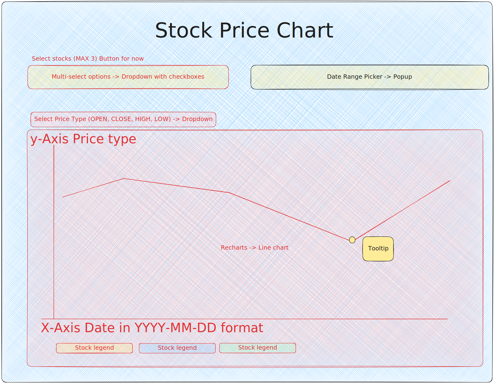

# Stock price chart

## 🎉 Tech stack

- **react** - JavaScript library for building user interfaces.
- **typescript** - Typed superset of JavaScript that compiles to plain JavaScript.
- **pnpm** - Fast, disk space efficient package manager.
- **vite** - Fast, opinionated frontend build tool.
- **@tanstack/query** - Async data fetching and state manager.
- **zustand** - A small, fast and scalable bearbones state-management solution using simplified flux principles.
- **recharts** - Composable charting library built on React component.
- **material ui** - Open-source react component library.
- **eslint** - Pluggable linting utility for TypeScript.
- **vitest** - Next generation testing framework for vite.
- **react-testing-library** - Simple and complete React DOM testing utilities that encourage good testing practices.

<br>

## 🤖 Local setup

### Prerequisite

- `pnpm` is used as package manager. Do follow installation guide [here](https://pnpm.io/installation) before running the commands below.
- `Polygon.io` [api](https://polygon.io/docs/stocks/getting-started) is used to fetch the stock prices. Create an account [here](https://polygon.io/dashboard/signup) to get an `API Key` and add it in the `.env.local` file before running the application.
  - `cp .env.example .env.local`

### Installation

```shell
pnpm install
```

### Running the application

```shell
pnpm run dev
```

### Test

```shell
# unit tests
pnpm run test

# unit test in watch mode
pnpm run test:watch

# unit test with coverage
pnpm run test:cov
```

<br>

## 📚 Feature list

```
As a fund manager
I want a single page application where I can select stocks on the US Stock Exchange and a date range (from and to date)
So that I can chart a time series of prices for the selected stocks and date range
```

### Acceptance Criteria

- [x] I can display the time series of prices of the selected stocks in the same chart.
- [x] I can’t select more than 3 stocks to display at the same time.
- [x] I can toggle between the following price types (Open, High, Low, Close) in the interactive chart.
- [x] I can change the date range in the interactive chart.

<br>

## 🎨 UI mockup



### Component breakdown

- `<PriceChart/>`
  - renders the chart, tooltip, legend based off the formatted dataset
- `<PriceType/>`
  - renders the Select component consisting of the Open, Close, Low, High options
- `<StockSelect/>`
  - renders the Multi-select component, allowing user to select up to 3 stocks to display on the line chart
- `<DateRangePicker/>`
  - renders the Date Range Picker component
- `<StockPriceChartContainer/>`

  - renders the overall layout which will render all the above components

  <br>

## 🚀 React + TypeScript + Vite Setup

This template provides a minimal setup to get React working in Vite with HMR and some ESLint rules.

Currently, two official plugins are available:

- [@vitejs/plugin-react](https://github.com/vitejs/vite-plugin-react/blob/main/packages/plugin-react/README.md) uses [Babel](https://babeljs.io/) for Fast Refresh
- [@vitejs/plugin-react-swc](https://github.com/vitejs/vite-plugin-react-swc) uses [SWC](https://swc.rs/) for Fast Refresh

## Expanding the ESLint configuration

If you are developing a production application, we recommend updating the configuration to enable type aware lint rules:

- Configure the top-level `parserOptions` property like this:

```js
export default tseslint.config({
  languageOptions: {
    // other options...
    parserOptions: {
      project: ["./tsconfig.node.json", "./tsconfig.app.json"],
      tsconfigRootDir: import.meta.dirname,
    },
  },
});
```

- Replace `tseslint.configs.recommended` to `tseslint.configs.recommendedTypeChecked` or `tseslint.configs.strictTypeChecked`
- Optionally add `...tseslint.configs.stylisticTypeChecked`
- Install [eslint-plugin-react](https://github.com/jsx-eslint/eslint-plugin-react) and update the config:

```js
// eslint.config.js
import react from "eslint-plugin-react";

export default tseslint.config({
  // Set the react version
  settings: { react: { version: "18.3" } },
  plugins: {
    // Add the react plugin
    react,
  },
  rules: {
    // other rules...
    // Enable its recommended rules
    ...react.configs.recommended.rules,
    ...react.configs["jsx-runtime"].rules,
  },
});
```
